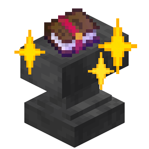

<h1 align="center">
    
  Easy Enchant
</h1>

 

This is a client side utility mod that allows you to easily and efficiently combine your enchanted books with gear at anvils!

## Usage

You can easily select your desired items to enchant in the anvil gui by hovering over and pressing your select item key.
Easy Enchant will not allow you to select certain books or gear if it deems them incompatible, or if it would make an already selected book useless.
> The default key bind is **Space**. However, this can be easily be changed in your keybind settings.

*Note! Easy Enchant will also save your selected items if you leave the anvil GUI, but not if you leave the world!*

 

After selecting your items, you can choose to either click:
- **Enchant fully**: This combines all your selected items in one process.
- **Enchant step**: This does only one step/combination of the optimized plan for combining all your items.

Easy Enchant will ***NOT*** let you do combination steps/processes if you do not have the levels to do so.
You can always hover over the different enchanting buttons to see how many levels or XP they would take.

Finally, you can toggle the current **optimizing mode**. The two options are **Levels** and **XP**. This decides what Easy Enchant optimizes for to be lowest.

### Reccomendations
- If you already have enough levels and want to just use the **Enchant fully** button, then you should optimize for **Levels**.
- If you are planning to obtain XP/levels, do one **Enchant step**, repeat, etc... then you should optimize for **XP**.

Realistically though, the difference in levels/xp b/w these modes is usually negligible; you probably don't need to worry about selecting the right one.
 

## Advanced Usage

Theres is also the **Config** button you can use to access the config of Easy Enchant.

You can change the **optimizing mode** here as well, along with some other new options:

- The colors of the background and border highlight for selected items.
> Note that the format of these colors is in *ARGB hexadecimal* format.

- **Packet Tick Delay**: The amount of game ticks the client waits before sending the next packet to move/pickup/place an item. If 0, the client sends a packet every tick.
> Note that each enchant step sends 4 packets, and the default **Packet Tick Delay** is 5 ticks.

- **Allow Renaming**: This allows you to rename your item after enchanting by not confirming/finishing the last enchant step. This settings work for both enchant buttons.

- **Instant Enchant**: This is an experimental and pretty untested feature that attempts to send *ALL* the item-moving packets in one single game tick. If selected, then **Packet Tick Delay** is ignored.

## Limitations

Apart from the mod being early in dev and kinda likely to crash, there are limitations:

- Combining lower level enchants together to make a higher level enchant is not supported well. Easy Enchant currently only supports this idea up to two books;
if you try to select more than two Looting I books + sword to make one Looting III sword, Easy Enchant will simply count these additional Looting I books as "useless", since it won't actually try to combine them all into one Looting III enchantment.
I do want to tackle this issue, but it's niche enough imo that I cba yet.

- Because Instant Enchant simply send all packets in one tick and hopes for the best, it can't know or account for if the anvil breaks in the middle of enchanting. Therefore, all items basically get deselected since Instant Enchant has already "finished".

### Credits

Credits to the [enchant order project](https://github.com/iamcal/enchant-order) for the inspo, [Cloth Config](https://github.com/shedaniel/cloth-config) & [Mod Menu](https://github.com/TerraformersMC/ModMenu) for easy API/API menu, and my goat ChatGPT for optimization algo and general java syntax help
